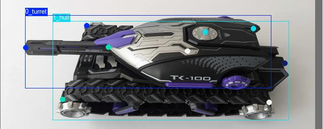

# Toy Tank's barrel localization and orientation

## Task Description

The task involves determining the exact position and orientation of the barrel of a radio-controlled tank toy using a smartphone camera. The goal is to develop a program that can accurately identify the 2D coordinates and orientation of the barrel in a captured image. This information will be used to simulate firing digital "ammunition" from the barrel's location via VR.

## Importance

The ability to pinpoint the barrel's position is crucial for creating a realistic gaming experience where digital projectiles originate from the correct location on the toy tank. This enhances the immersion and accuracy of gameplay, providing a more engaging and authentic user experience.

## Implementation Considerations

The program will process the image, locate the barrel, and calculate its coordinates and orientation. Outputs may include visual indicators or data for further use in digital gameplay.

## Limitations

- Limited Data: Only 4 images provided.
- Different Perspectives: Each image shows the tank from a different angle.
- Fixed Barrel Direction: Barrel always points in the same direction, limiting variability.

## Requirements

1. Ensure Python 3.11 is installed on your system. If not, download and install it from the official Python website.
2. Make sure that the IPython kernel is installed in the environment to run the Jupyter Notebooks provided.
3. Create a venv and install all packages defined in *requirements.txt*.
4. Run *1_training.ipynb* to train the `YOLOv8n-pose` model on the tanks data sets (training, val)
5. Run *2_inference.ipynb* to test the custom model (adjust the confidence threshold value if necessary) and estimate the barrel's position and direction.

## Approach

Used YOLOv8 for both object detection and pose estimation, ensuring accurate localization and orientation of tank components. The use of data augmentation and a pretrained model enhances the robustness and efficiency of the solution, making it suitable for deployment on mobile platforms.

Here is a summary of the key steps and their significance:
- **Data Splitting**

    - Training and Validation Split: The dataset was split into three training images and one validation image. This ensures that the model is trained on diverse perspectives of the tank (side, top, and front edge) and validated on a different perspective (side top), promoting generalization.

- **Data Annotation** (with RoboFlow)
    - Images have been preprocessed by being resized to 640x640 pixels to match the maximum dimensions for YOLOv8.
    - Bounding Boxes and Key Points: Bounding boxes were drawn for the hull and turret (including the barrel) for object detection, while key points were annotated for pose estimation. This dual annotation strategy allows the model to learn both the localization and orientation of the tank components.

    

  (* In the screenshot `tank` means the hull, `barrel` means the turret that includes the barrel too)

- **Data Augmentation** (with RoboFlow)

    - Data Augmentation: Various transformations were applied to the training images to create an augmented dataset. This step increases the size and variability of the training data, which helps the model generalize better to unseen images. The datasets were exported in YOLOv8 format, ensuring compatibility with the training framework.

- **Model Training**

    - YOLOv8n Model: A pretrained YOLOv8n (nano) model specialized on pose estimation (`YOLOv8n-pose`) was used as the base for training. This model was fine-tuned on the augmented dataset to detect the barrel's localization and orientation, which is crucial for mobile platforms due to its lightweight nature.
    - Training Configuration: Training parameters such as image size and epochs were configured, and the best model weights were saved. Setting random seeds ensured reproducibility of the results.

- **Inference**

    - Custom Model Inference: The trained YOLOv8n model was loaded for inference on test images. A specified confidence threshold was used to filter predictions.
    - Keypoint Extraction: Key points for the turret (including the barrel) and hull were extracted from the inference results. These key points were used to estimate the barrel’s relative rotation angle and orientation vector components, providing insights into the barrel's orientation relative to the tank.
