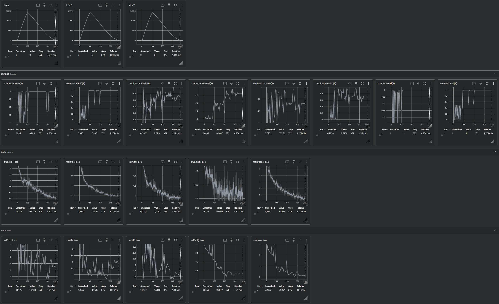
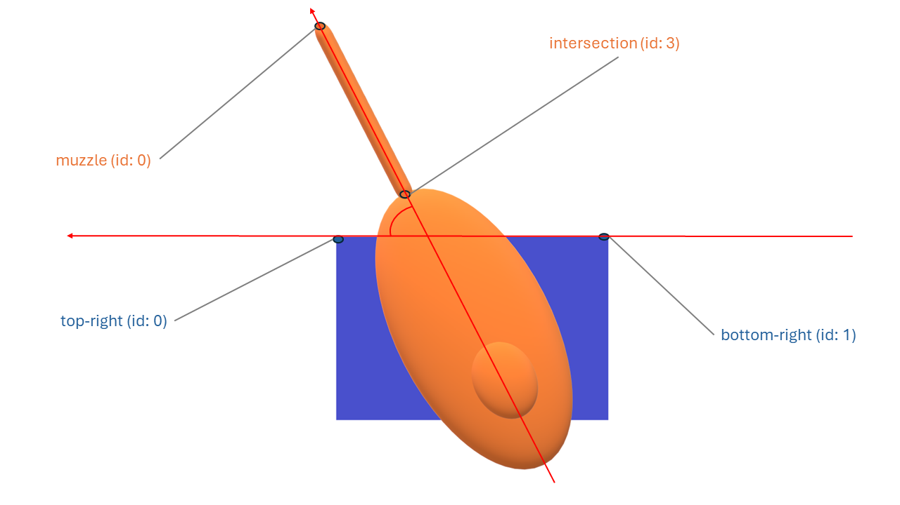

# Toy Tank's barrel localization and orientation

## Task Description

The task involves determining the exact position and orientation of the barrel of a radio-controlled tank toy using a smartphone camera. The goal is to develop a program that can accurately identify the 2D coordinates and orientation of the barrel in a captured image. This information will be used to simulate firing digital "ammunition" from the barrel's muzzle via AR.

## Importance

The ability to pinpoint the barrel's position is crucial for creating a realistic gaming experience where digital projectiles originate from the correct location on the toy tank. This enhances the immersion and accuracy of gameplay, providing a more engaging and authentic user experience.

## Implementation Considerations

The program will process the image, locate the barrel, and calculate its coordinates and orientation. Outputs may include visual indicators or data for further use in digital gameplay.

## Limitations

- Limited Data: Only 4 images provided.
- Different Perspectives: Each image shows the tank from a different angle.
- Fixed Barrel Direction: Barrel always points in the same direction, limiting variability.

To provide a more comprehensive set of instructions for running the provided code, here is a detailed step-by-step guide with links for additional resources:

## Instructions to Run the Code

### **1. Install Python**

Ensure Python (ideally Python 3.11) is installed on your system. If it's not installed, you can download and install it from the [official Python website](https://www.python.org/downloads/). Alternatively, you can download [Anaconda](https://www.anaconda.com/products/distribution), which includes Python and many other useful packages.

- **Check if Python is installed**:
  ```sh
  python --version
  ```
  or
  ```sh
  python3 --version
  ```

### **2. Create a Virtual Environment**

Create a virtual environment to manage dependencies and avoid conflicts with other projects.

- **Create a virtual environment**:
  ```sh
  python -m venv myenv
  ```

- **Activate the virtual environment**:
  - On Windows:
    ```sh
    myenv\Scripts\activate
    ```
  - On macOS/Linux:
    ```sh
    source myenv/bin/activate
    ```

For more information on virtual environments, visit the [Python documentation](https://docs.python.org/3/tutorial/venv.html).

### **3. Install Jupyter and IPython Kernel**

Ensure that Jupyter and the IPython kernel are installed in the environment to run the Jupyter Notebooks provided.

- **Install Jupyter**:
  ```sh
  pip install jupyter
  ```

- **Install IPython kernel**:
  ```sh
  pip install ipykernel
  ```

For more details on installing Jupyter, refer to the [official Jupyter documentation](https://jupyter.org/install).

### **4. Install Required Packages**

Install all packages defined in `requirements.txt`.

- **Install packages**:
  ```sh
  pip install -r requirements.txt
  ```

### **5. Run the Code**

#### **5.1 Jupyter Notebooks**

Run the Jupyter Notebooks to train and test the model.

- **Start Jupyter Notebook**:
  ```sh
  jupyter notebook
  ```

- **Train the YOLOv8n-pose model**:
  Open and run `1_training.ipynb` to train the `YOLOv8n-pose` model on the toy tanks datasets (train, valid).

- **Test the custom model**:
  Open and run `2_inference.ipynb` to test the custom model and estimate the barrel's position and direction. For that, change to the path in `image_path` in `2_inference.ipynb` pointing to the test image(s).

```python
...

image_path = "path/to/test/image.jpg"  # Update this path to the test image (or the folder containing the test images)

...
```

> [!NOTE]
> If the inference fails as either one of the objects won't be detected or there same class will be detected more than once in the test image(s), instead of executing `results = model(image_path)` please make use of `results = model.predict(image_path, save=False, conf=0.5)` for a single image and adjust the confidence score treshold value there (code snippet is provided).

In the code, you can change the reference keypoint from `turret_keypoints[3]` (barrel's start intersecting with turret) to `turret_keypoints[1]`(top of turret) to get a better estimate of the barrel's orientation, as the top of turret keypoint is visible in all images and therefore has a higher confidence score:
```python
...

intersection = turret_keypoints[1]  # Instead of turret_keypoints[3]

...
```

This code will execute and perform inference on the specified test image, displaying the image and printing the following information:

- Image processing details, including the file path, dimensions, and detection results.
- Speed metrics for preprocessing, inference, and postprocessing.
- Detected class names and their corresponding indices.
- Keypoints data for the detected objects.
- Confidence scores for keypoints.
- Barrel vector coordinates.
- Estimated rotation angle of the barrel relative to the hull.
- Barrel orientation description relative to the hull.
- Barrel orientation vector components.

#### 5.2 Python script (Inference)
Alteranative, for the inference, a `2_inference.py` script is provided. It performs inference on a test image using the trained `YOLOv8n-pose` model. The script accepts two command-line arguments:

1. **image_path**: The path to the test image.
2. **keypoint**: The keypoint to use for calculating the barrel's position and direction. Choose between `turret_keypoints[1]` (turret's top keypoint) or `turret_keypoints[3]` (barrel-turret intersection keypoint).

To run the script from the terminal with `turret_keypoints[3]`:
```sh
python 2_inference.py path/to/test/image.jpg turret_keypoints[3]
```

Or with `turret_keypoints[1]`:
```sh
python 2_inference.py path/to/test/image.jpg turret_keypoints[1]
```


## Approach

Used YOLOv8n for both object detection and pose estimation, ensuring accurate localization and orientation of tank components. The use of data augmentation and a pretrained model enhances the robustness and efficiency of the solution, making it suitable for deployment on mobile platforms.

Here is a summary of the key steps and their significance:
- **Data Splitting**

    - Training and Validation Split: The dataset was split into three training images and one validation image. This ensures that the model is trained on diverse perspectives of the tank (side, top, and front edge) and validated on a different perspective (side top), promoting generalization.

- **Data Annotation** (with RoboFlow)
    - Images have been preprocessed by being resized to 640x640 pixels to match the maximum dimensions for YOLOv8.
    - Bounding Boxes and Key Points: Bounding boxes were drawn for the hull and turret (including the barrel) for object detection, while key points were annotated for pose estimation. This dual annotation strategy allows the model to learn both the localization and orientation of the tank components.

    

    

- **Data Augmentation** (with RoboFlow)

    - Data Augmentation: Various transformations were applied to the training images to create an augmented dataset. This step increases the size and variability of the training data, which helps the model generalize better to unseen images. The datasets were exported in YOLOv8 format, ensuring compatibility with the training framework.

- **Model Training**

    - Model: A pretrained YOLOv8n (nano) model specialized on pose estimation (`YOLOv8n-pose`) was used as the base for training. This model was fine-tuned on the augmented dataset to detect the barrel's localization and orientation, which is crucial for mobile platforms due to its lightweight nature.
    - Training Configuration: Training parameters such as image size and epochs were configured, and the best model weights were saved. Setting random seeds ensured reproducibility of the results.

    

- **Inference**

    - Custom Model Inference: The trained YOLOv8n model was loaded for inference on test images. A specified confidence threshold was used to filter predictions.
    - Keypoint Extraction: Key points for the turret (including the barrel) and hull were extracted from the inference results. These key points were used to estimate the barrel’s relative rotation angle and orientation vector components, providing insights into the barrel's orientation relative to the tank's hull.

    

## Limitations and Conclusion

- **Lack of Sufficient Data**
The model's performance is not perfect, likely due to the insufficient amount of data.  Additionally, the dataset's limitations different perspectives in each image, and a lack of variance in tank characteristics such as color, direction, and size, which further restrict the model's ability to generalize. Machine learning models require large and diverse datasets to generalize well to new, unseen data. When the dataset is limited, the model may struggle to learn the underlying patterns effectively, leading to suboptimal performance.

- **Alternative Validation Techniques**
An alternative to data augmentation could have been Leave-One-Out Cross-Validation (LOOCV). LOOCV is a robust method for evaluating model performance, especially when dealing with small datasets. It involves using each data point as a single test case while the remaining data points form the training set. This process is repeated for each data point, providing an unbiased estimate of model performance. However, LOOCV is computationally expensive.

- **Data Augmentation Techniques**
Other data augmentation techniques, such as flipping and rotation, could have been employed to generate new images and potentially improve the model. These methods help prevent overfitting and improve model robustness by exposing the model to a wider variety of data.

    When using AR with a smartphone, it is crucial to consider the user's perspective. Augmentation techniques should be applied judiciously to ensure that the augmented elements align correctly with the real-world environment and provide a seamless user experience. For instance, while geometric transformations like flipping and rotation can enhance the model's robustness, they must not distort the perspective in a way that makes the AR experience unrealistic or disorienting for the user. Therefore, careful calibration and validation are necessary to ensure that the augmented reality elements behave as expected in the user's view.

- **Alternative Models**: While `YOLOv8n-pose` was utilized for pose estimation, `ViTPose small` could have been an alternative. ViTPose small, based on Vision Transformers, offers high accuracy and flexibility, and is particularly effective for detailed pose estimation tasks. Additionally, ViTPose's ability to capture fine-grained details and its high parallelism make it potentially better suited for this task. Unlike YOLOv8, which uses a convolutional neural network (CNN) architecture, ViTPose leverages a Transformer architecture that excels in capturing long-range dependencies and contextual information, which can enhance the precision of identifying the 2D coordinates and orientation of the barrel in the image.

* **Augmented Reality (AR) Considerations**
In the context of augmented reality (AR), estimating a 3D vector of the tank from 2D images is crucial for accurate digital projectile trajectories. This task requires generating a depth map from the 2D images to understand the spatial relationships and distances within the scene. Accurate depth estimation ensures that digital elements interact realistically with the physical environment, which is essential for creating a convincing AR experience.